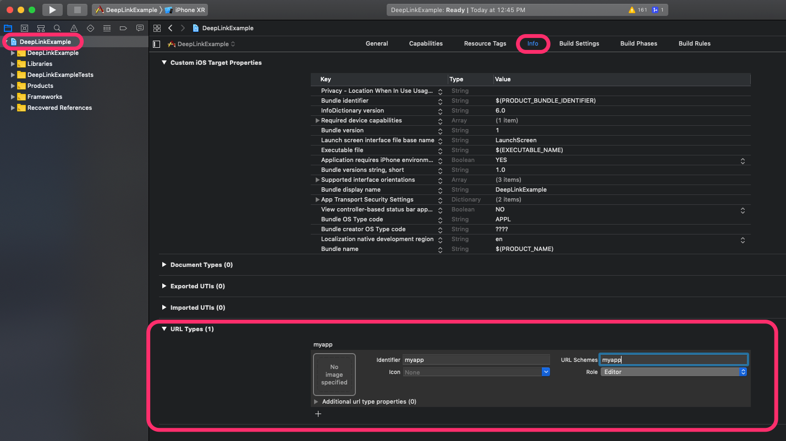
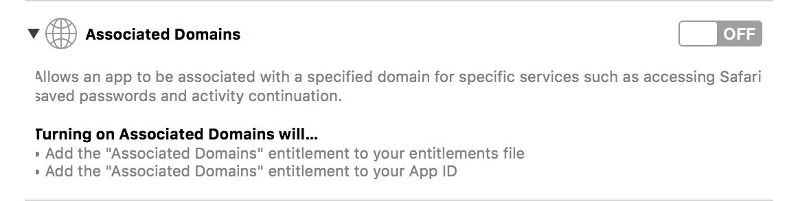
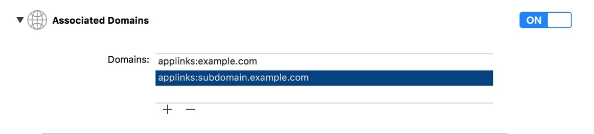

# Deep Link - Universal Link

Cách áp dụng Deep Link và Universal Link vào React-Native App

### Mục lục

- [Deep Link](#deep-link)
  - [iOS](#deep-link-ios)
  - [Android](#deep-link-android)
  - [Handle](#deep-link-handle)
- [Universal Link](#universal-link)
  - [Config ở Server](#server-configuration)
    - [Apple App Site Association File](#apple-json-metadata-file)
      - [iOS 12 trở về](#ios-12-and-earlier)
      - [iOS 13](#ios-13-and-later)
    - [Tạo AASA file trên server](#create-aasa-file)
    - [Thay đổi Content-Type](#modifying-the-content-type)
      - [Apache](#apache-configuration)
      - [Nginx](#nginx-configuration)
      - [Common Issues](#server-common-issue)
  - [Config ở Client](#client-configuration)
    - [Associated Domain](#associated-domain)
    - [Implement trong AppDelegate](#implement-the-corresponding-appdelegate-methods)
      - [iOS 9.1 trở về](#ios-9.0-and-earlier)
      - [iOS 9.1+](#ios-9.0-and-later)
    - [Client Common Issues](#client-common-issues)

## <a name="deep-link"></a> Deep Linking

Deep Linking là việc sử dụng một scheme (chuỗi) được định nghĩa sẵn để mở ứng dụng từ trình duyệt hoặc ứng dụng khác.

Một scheme thường có định dạng `scheme://host/param` (`host` và `param` là optional)

Ví dụ: `urbox://app/home`

### <a name="deep-link-ios"></a> iOS

- Mở IOS Project bằng XCode
- Chọn Target Gốc
- Chọn Tab Info
- Tìm URL Types
- Điền scheme, ví dụ `urbox`



Sau đó mở `AppDelegate.m` và thêm vào phần đầu:

`#import “React/RCTLinkingManager.h”`

Thêm trước `@end`:

```
- (BOOL)application:(UIApplication *)application openURL:(NSURL *)url
sourceApplication:(NSString *)sourceApplication annotation:(id)annotation
{
return [RCTLinkingManager application:application openURL:url
sourceApplication:sourceApplication annotation:annotation];
}

```

### <a name="deep-link-ios"></a> Android

- Mở `android/src/main/AndroidManifest.xml` và thêm như sau:

```
<manifest xmlns:android="http://schemas.android.com/apk/res/android"
 package="com.deeplinkexample">

   <uses-permission android:name="android.permission.INTERNET" />

   <application
     android:name=".MainApplication"
     android:label="@string/app_name"
     android:icon="@mipmap/ic_launcher"
     android:roundIcon="@mipmap/ic_launcher_round"
     android:allowBackup="false"
     android:theme="@style/AppTheme">
     <activity
       android:name=".MainActivity"
       android:label="@string/app_name"
       android:configChanges="keyboard|keyboardHidden|orientation|screenSize"
       android:launchMode="singleTask"
       android:windowSoftInputMode="adjustResize">
       <intent-filter>
           <action android:name="android.intent.action.MAIN" />
           <category android:name="android.intent.category.LAUNCHER" />
       </intent-filter>
        <intent-filter>
             <action android:name="android.intent.action.VIEW" />
             <category android:name="android.intent.category.DEFAULT" />
             <category android:name="android.intent.category.BROWSABLE" />
             <data android:scheme="example"
                android:host="app"
                android:pathPrefix="/"
              />
         </intent-filter>
     </activity>
     <activity android:name="com.facebook.react.devsupport.DevSettingsActivity" />
   </application>
</manifest>
```

### <a name="deep-link-handle"></a> Handle trong React Native

Trong class `App.js` thêm:

```
componentDidMount() {
  Linking.addEventListener('url', this.handleOpenURL);
}
componentWillUnmount() {
  Linking.removeEventListener('url', this.handleOpenURL);
}
handleOpenURL(event) {
  // làm gì đó với URL
  console.log(event.url);
}
```

## <a name="universal-link"></a> Universal Link

Một vấn đề của Deep Link trong iOS 13, đó là khi bấm vào một scheme không phải `http` hoặc `https` trên Safari (VD: `urbox://`) và app đón scheme đó chưa được cài đặt trên thiết bị, browser sẽ hiện lỗi ``Không thể mở do đường dẫn không xác định``. Để tránh lỗi này, ta phải đăng ký một đường link với apple, gọi là Universal Link có `https`.

## <a name="server-configuration"></a> Config ở Server

Set up Universal Link trên server

### <a name="apple-json-metadata-file"></a> Apple JSON Metadata file

#### <a name="create-a-json-file-called-apple-app-association"></a> Tạo file JSON "**apple-app-association**"

##### <a name="ios-12-and-earlier"></a> Template của iOS 12 trở về

```
{
    "applinks": {
        "apps": [],
        "details": [
            {
                "appID": "<TEAM_DEVELOPER_ID>.<BUNDLE_IDENTIFIER>",
                "paths": [ "*" ]
            },
            {
                "appID": "<TEAM_DEVELOPER_ID>.<BUNDLE_IDENTIFIER>",
                "paths": [ "/articles/*" ]
            },
            {
                "appID": "<TEAM_DEVELOPER_ID>.<ANOTHER_APP_BUNDLE_IDENTIFIER>",
                "paths": ["/blog/*","/articles/*"]
            }
        ]
    }
}
```

**CHÚ Ý!**

- `"apps":` phải có value là `[]`.
- `apple-app-site-association` không có `.json` extension.

##### <a name="ios-13-and-later"></a> For iOS13 and later

Template này có thể handle các URL tốt hơn, ví dụ có thể exlude các url `#` thường thấy trong AngularJS

```
{
  "applinks": {
      "details": [
           {
             "appIDs": [ "ABCDE12345.com.example.app", "ABCDE12345.com.example.app2" ],
             "components": [
               {
                  "#": "no_universal_links",
                  "exclude": true,
                  "comment": "Matches any URL whose fragment equals no_universal_links and instructs the system not to open it as a universal link"
               },
               {
                  "/": "/buy/*",
                  "comment": "Matches any URL whose path starts with /buy/"
               },
               {
                  "/": "/help/website/*",
                  "exclude": true,
                  "comment": "Matches any URL whose path starts with /help/website/ and instructs the system not to open it as a universal link"
               }
               {
                  "/": "/help/*",
                  "?": { "articleNumber": "????" },
                  "comment": "Matches any URL whose path starts with /help/ and which has a query item with name 'articleNumber' and a value of exactly 4 characters"
               }
             ]
           }
       ]
   },
   "webcredentials": {
      "apps": [ "ABCDE12345.com.example.app" ]
   }
}
```

**CHÚ Ý!**

- File `apple-app-site-association` không có `.json` extension.

#### <a name="create-aasa-file"></a> Tạo file "apple-app-association" trên server

1. Login đến web server:

```
ssh root username@example.com
```

2. Chuyển đến thư mục root của webserver _(Có thể ở thư mục khác trên webserver của bạn)_

```
cd /var/www/
```

3. Tạo file `apple-app-site-association`

```
sudo nano apple-app-site-association
```

4. Copy content của file apple-app-site-association của bạn vào đây

5. Lưu và thoát (Ctrl + X -> Y)

### <a name="modifying-the-content-type"></a> Thay đổi Content-Type của apple-app-site-association

File apple-app-association-file cần có Content-Type:

| OS            | Content-Type             |
| ------------- | ------------------------ |
| iOS9 or later | `application/json`       |
| iOS8 or lower | `application/pkcs7-mime` |

Below you'll find instructions on how to do this for your web server.

#### <a name="apache-configuration"></a> Apache configuration

- Thay đổi `/etc/apache2/sites-available/default-ssl` (hoặc file tương tự) để có `<Files>` snippet:

```
<Directory /path/to/root/directory/>
...
<Files apple-app-site-association>
Header set Content-type "application/json"
</Files>
</Directory>
```

#### <a name="nginx-configuration"></a> nginx configuration

- Thay đổi `/etc/nginx/sites-available/ssl.example.com` (hoặc file tương tự) để có `location /apple-app-assocation` snippet:

```
server {
   ...
   location /apple-app-site-association {
      default_type application/application/json;
   }
}
```

### <a name="server-common-issues"></a> Common issues

The JSON validation may fail if:

- JSON file invalid
- Redirects đến một url không phải HTTPS - Tất cả redirects sẽ khiến webscraper bot của Apple không thể parse JSON file
- The server trả về 400-499 HTTP status code
- The server trẻ về 500-599 HTTP status code - The Apples webscraper bot assumes that the file is temporarily unavailable and may retry again

Thông tin thêm: [Supporting Associated Domains in Your App](https://developer.apple.com/documentation/safariservices/supporting_associated_domains_in_your_app) and scroll down to the section "Validate the Apple App Site Association File".

## <a name="client-configuration"></a>Client configuration

### <a name="associated-domains"></a> Associated domains

1. Mở Xcode và đến `<MyApp>.xcodeproj/<Build target>/Capabilities` và chỉnh Associated Domain thành ON.



2. Chọn URL mà app sẽ response.



- Một file tên là `<AppName>.entitlements` sẽ được sinh ra.
- Cần viết chính xác subdomain.

### <a name="implement-the-corresponding-appdelegate-methods"></a> Implement các method trong `AppDelegate`:

#### <a name="ios-9.0-and-earlier"></a>iOS 9.0 về trước

Thêm vào `AppDelegate.m`

```
- (BOOL)application:(UIApplication *)application openURL:(NSURL *)url sourceApplication:(NSString *)sourceApplication annotation:(id)annotation;
```

#### <a name="ios-9.1-and-later"></a>iOS 9.1+

- iOS 9.1 trở đi hỗ trợ [Apple's Universal Links](https://developer.apple.com/library/archive/documentation/General/Conceptual/AppSearch/UniversalLinks.html) và handle bằng cách thêm vào `AppDelegate.m`:

```
- (BOOL)application:(UIApplication *)application continueUserActivity:(NSUserActivity *)userActivity restorationHandler:(void (^)(NSArray *))restorationHandler {
    NSURL *url = userActivity.webpageURL;
    // handle url
}

- (BOOL)application:(UIApplication *)app openURL:(NSURL *)url options:(NSDictionary<UIApplicationOpenURLOptionsKey, id> *)options {
    // handle url
}
```

### <a name="client-common-issues"></a> Common issues

Các file dưới đây sẽ được thay đổi:

- `<AppName>.entitlements` file trong project iOS
- `apple-app-site-association`

Khi Test Deep Link hoặc Universal Link hãy sử dụng app Notes trên iPhone, khi nhấn giữ link sẽ hiện ra `Mở bằng <App>`
