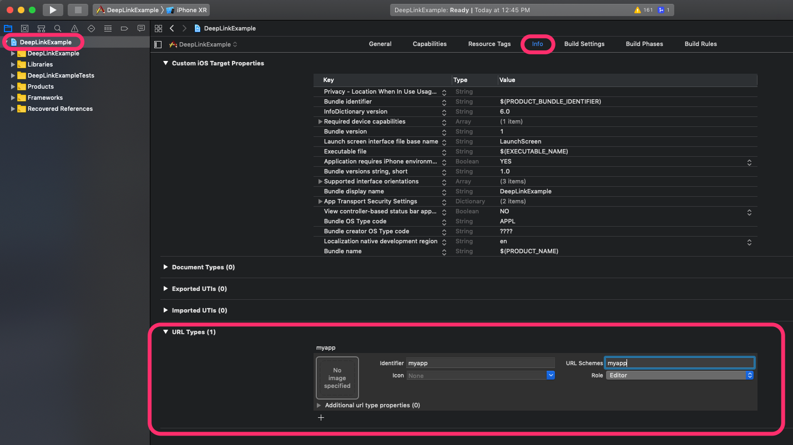

# Deep Link - Universal Link

Cách áp dụng Deep Link và Universal Link vào React-Native App


### Table of Contents

- [Deep Link](#deep-link)
  - [iOS](#deep-link-ios)
  - [Android](#deep-link-android)
  - [Handle](#deep-link-handle)
- [Universal Link](#universal-link)
  

## <a name="deep-link"></a> Deep Linking

Deep Linking là việc sử dụng một scheme (chuỗi) được định nghĩa sẵn để mở ứng dụng từ trình duyệt hoặc ứng dụng khác.

Một scheme thường có định dạng `scheme://host/param` (``host`` và ``param`` là optional)

Ví dụ: `urbox://app/home`

### <a name="deep-link-ios"></a> IOS

- Mở IOS Project bằng XCode
- Chọn Target Gốc
- Chọn Tab Info
- Tìm URL Types
- Điền scheme, ví dụ ``urbox``



Sau đó mở ``AppDelegate.m`` và thêm vào phần đầu:

``#import “React/RCTLinkingManager.h”``

Thêm trước ``@end``:

```
- (BOOL)application:(UIApplication *)application openURL:(NSURL *)url
sourceApplication:(NSString *)sourceApplication annotation:(id)annotation
{
return [RCTLinkingManager application:application openURL:url
sourceApplication:sourceApplication annotation:annotation];
}

```

### <a name="deep-link-ios"></a> Android

- Mở ``android/src/main/AndroidManifest.xml`` và thêm như sau:

```
<manifest xmlns:android="http://schemas.android.com/apk/res/android"
 package="com.deeplinkexample">

   <uses-permission android:name="android.permission.INTERNET" />

   <application
     android:name=".MainApplication"
     android:label="@string/app_name"
     android:icon="@mipmap/ic_launcher"
     android:roundIcon="@mipmap/ic_launcher_round"
     android:allowBackup="false"
     android:theme="@style/AppTheme">
     <activity
       android:name=".MainActivity"
       android:label="@string/app_name"
       android:configChanges="keyboard|keyboardHidden|orientation|screenSize"
       android:launchMode="singleTask"
       android:windowSoftInputMode="adjustResize">
       <intent-filter>
           <action android:name="android.intent.action.MAIN" />
           <category android:name="android.intent.category.LAUNCHER" />
       </intent-filter>
        <intent-filter>
             <action android:name="android.intent.action.VIEW" />
             <category android:name="android.intent.category.DEFAULT" />
             <category android:name="android.intent.category.BROWSABLE" />
             <data android:scheme="urbox"
                android:host="app"
                android:pathPrefix="/"
              />
         </intent-filter>
     </activity>
     <activity android:name="com.facebook.react.devsupport.DevSettingsActivity" />
   </application>
</manifest>
```

### <a name="deep-link-handle"></a> Handle trong React Native

Trong class ``App.js`` thêm:

```
componentDidMount() {
  Linking.addEventListener('url', this.handleOpenURL);
}
componentWillUnmount() {
  Linking.removeEventListener('url', this.handleOpenURL);
}
handleOpenURL(event) {
  // làm gì đó với URL
  console.log(event.url);
}
```
